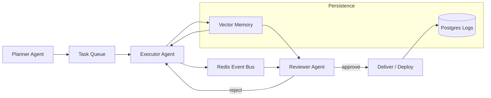

# xander-hive-framework

Scalable multi‑agent orchestration with persistent sessions, shared vector memory, Redis event bus, and self‑repair.

## 🐝 The Problem

Single agents hit context and coordination limits. Complex workflows require swarms that can share memory, communicate reliably, and improve from experience.

## The Solution

XANDER Hive is the orchestration backbone for reliable autonomous agent teams:

- **Persistent sessions** — agents keep identity across tasks
- **Shared vector memory** — semantic recall for all agents
- **Redis event bus** — reliable pub/sub messaging
- **RLHF‑style learning loops** — agents learn from outcomes
- **Self‑repair** — peers can fix broken agents via review

Used across the HiveSec ecosystem but generic enough for trading bots, research swarms, etc.

## Architecture



## Quick Start

```bash
git clone https://github.com/GBOYEE/xander-hive-framework.git
cd xander-hive-framework
cp .env.example .env
docker compose up -d
```

## Components

| Component | Role |
|-----------|------|
| **Planner** | Breaks high‑level goals into executable steps |
| **Executor** | Runs tools & skills, writes results |
| **Reviewer** | Validates outputs before delivery |
| **Vector Memory** | FAISS + embeddings for semantic recall |
| **Event Bus** | Redis pub/sub for async coordination |
| **Dashboard** | Streamlit UI for monitoring & control |

## Design Philosophy

Inspired by multi‑agent RLHF and hive‑mind architectures. Agents operate with persistent identity, share a common memory, and learn from each other’s successes and failures. Safety is baked in via mandatory review and rollback hooks.

## Research & Ethics

XANDER Hive is designed for domains where reliability and auditability matter: AIOps, security auditing, and infrastructure automation.

## License

MIT
```
